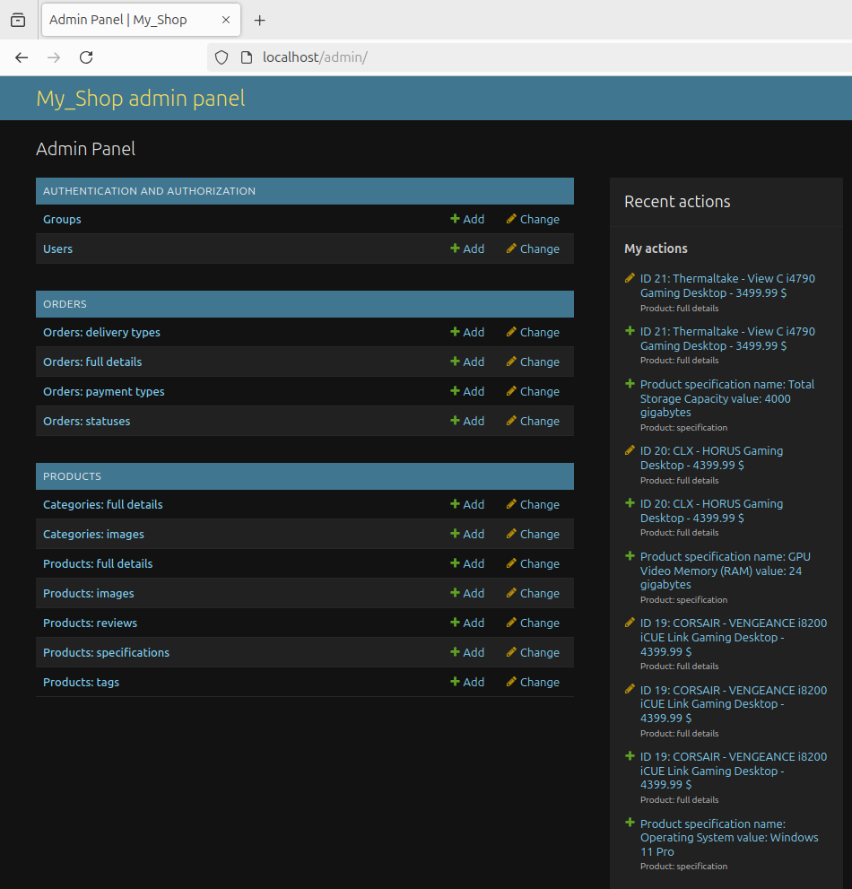

<h1 align="center">My_Shop (Megano)</h1>
<p float="left"  align="center">
  
  
</p>


### Description  ###

This is an e-commerce shop where users can browse, select, and purchase products. 
Shop additionally includes an integrated payment system, powered by a custom bank API. 
An admin panel is provided for shop owners and staff to manage products, catalogs, 
orders, users, and other essential data to run the shop efficiently.

### Functions ###

Any user can:
- Browse and search for products
- Add products to the cart
- Sign up, sign in or log out

Registered user can:
- View and update own profile
- Create and pay order
- View orders history and track order status

Shop staff (via Django Admin) can:
- CRUD products, categories, orders and other essential data
- View and manage user's profiles (Admin only)


### Backend Stack ###

- Python 3.12
- Django, DRF
- MySQL
- Redis
- Celery
- NGINX + Gunicorn
- Docker
- Poetry, Docstring and Type Hint 

### Getting started 

This app is easy to start. Follow  the bellow requirements for Linux (Ubuntu): 

#### Installation
Ignore the following steps if you have already installed Docker Compose, Python 3.12 and Git.

1. Install docker engine and compose plugin for it.   
- Follow steps from official site:  [Docker Engine Install](https://docs.docker.com/engine/install/ubuntu/) and [Docker Compose Install](https://docs.docker.com/compose/install/)

2. Install one of 
- Python 3.12 from official site:  [Python Downloads](https://www.python.org/downloads/)
- IDE (PyCharm or Visual Stidio Code or ...)

3. Install Git if required.
- Follow steps from official site: [Git install](https://git-scm.com/book/en/v2/Getting-Started-Installing-Git)

#### Clone repository
From the command line: 
```
git clone https://github.com/ssergey-92/my_shop.git
```

#### Running the application:

- From the command line: 
```
cd 'your path to project root directory'
python start_project.py
```
- From IDE
```
run start_project.py
```

### Developers ###

Backend code was written by Sergey Solop.    
Contact email for suggestions and feedbacks: solop1992@mail.ru  
Frontend code was provided by Skillbox learning platform as a part of Python Course.  
Website: [Skillbox](https://skillbox.ru/)